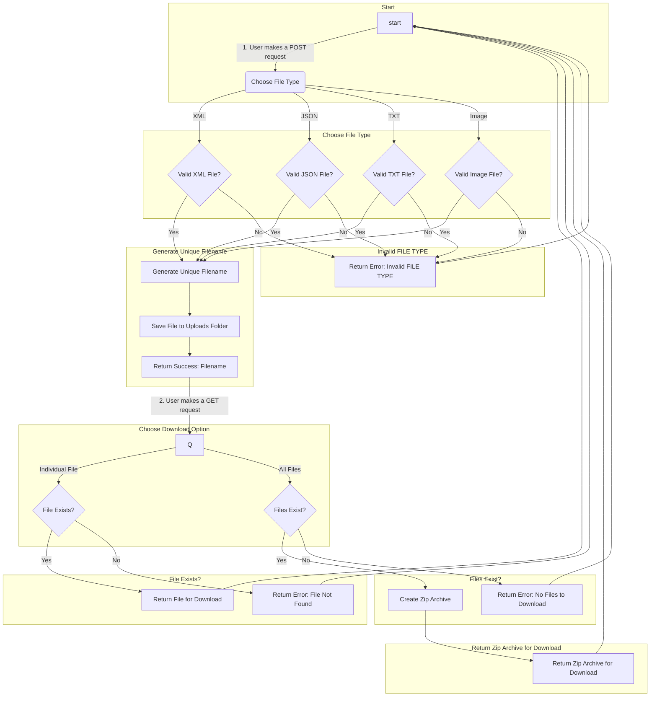

# Flask Simple File Server (FSFS)

## Table of Contents

- [Introduction](#introduction)
- [Features](#features)
- [Installation](#installation)
- [Usage](#usage)
  - [Uploade](#uploade)
    - [Uploading XML Files](#uploading-xml-files)
    - [Uploading JSON Files](#uploading-json-files)
    - [Uploading TXT Files](#uploading-txt-files)
    - [Uploading Image Files](#uploading-image-files)
  - [Downloade](#download)
    - [Downloading Files](#downloading-files)
    - [Download All Files](#download-all-files)
    - [Download Files by Format](#download-files-by-format)
  - [examples](#examples)
- [Dependencies](#dependencies)
- [Flowchart](#flowchart)
- [License](#license)

## Introduction

This Python Flask application provides a simple file upload and download service. It allows users to upload XML, JSON, TXT, and image files, and then download them individually or as a zip archive.

## Features

- Supports uploading XML, JSON, TXT, and image files.
- Allows downloading files individually or as a zip archive.
- Convenient RESTful API for file handling.

## Installation

1. Clone the repository:

2. Navigate to the project directory:

3. Install the required dependencies:

   ```bash
   pip install -r requirements.txt
   ```

## Usage

### Uploade

#### Uploading XML Files

To upload an XML file, send a POST request to `/upload/xml`.

#### Uploading JSON Files

To upload a JSON file, send a POST request to `/upload/json`.

#### Uploading TXT Files

To upload a TXT file, send a POST request to `/upload/txt`.

#### Uploading Image Files

To upload an image file, send a POST request to `/upload/image`.

### Download

#### Downloading Files

To download a file, send a GET request to `/download/filename`, where `filename` is the name of the file.

##### Download All Files

To download all uploaded files as a zip archive, send a GET request to `/download/all`.

##### Download Files by Format

To download all files of a specific format as a zip archive, send a GET request to `/download/format/file_format`, where `file_format` is the desired file format.

### examples

- [upload](example/upload.py)
- [downloads](example/download.py)

## Dependencies

- Flask
- Python (>= 3.6)
- datetime
- shutil

Install the required dependencies using the provided `requirements.txt` file.

## Flowchart



## License

This project is licensed under the MIT License - see the [LICENSE](LICENSE) file for details.
