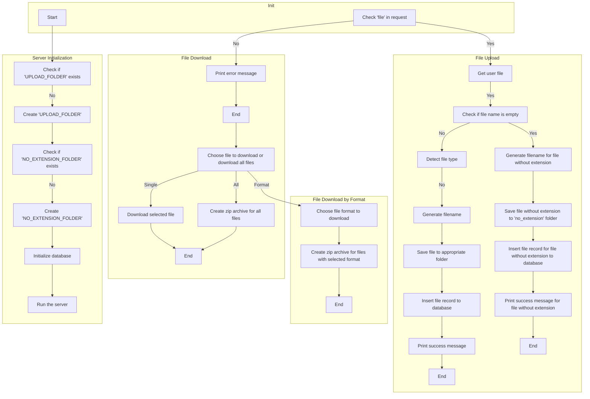

# Flask Simple File Server (FSFS)

## Table of Contents

- [Introduction](#introduction)
- [Features](#features)
- [Installation](#installation)
- [Usage](#usage)
  - [Upload](#upload)
    - [Uploading XML, JSON, TXT, and Image Files](#uploading-files)
  - [Download](#download)
    - [Downloading Files](#downloading-files)
    - [Download All Files](#download-all-files)
    - [Download Files by Format](#download-files-by-format)
  - [Examples](#examples)
- [Dependencies](#dependencies)
- [Flowchart](#flowchart)
- [License](#license)

## Introduction

This Python Flask application provides a simple file upload and download service. It allows users to upload XML, JSON, TXT, and image files, and then download them individually or as a zip archive.

## Features

- Supports uploading XML, JSON, TXT, and image files.
- Allows downloading files individually or as a zip archive.
- Convenient RESTful API for file handling.

## Installation

1. Clone the repository:

   ```bash
   git clone [repository_url]
   ```

2. Navigate to the project directory:

   ```bash
   cd flask-simple-file-server
   ```

3. Install the required dependencies:

   ```bash
   pip install -r requirements.txt
   ```

## Usage

### Upload

#### Uploading Files

To upload a file, send a POST request to `/upload` with the file attached. The server will automatically categorize the file based on its type.

### Download

#### Downloading Files

To download a file, send a GET request to `/download/filename`, where `filename` is the name of the file.

##### Download All Files

To download all uploaded files as a zip archive, send a GET request to `/download/all`.

##### Download Files by Format

To download all files of a specific format as a zip archive, send a GET request to `/download/format/file_format`, where `file_format` is the desired file format.

### Examples

- [upload](example/upload.py)
- [downloads](example/download.py)

## Dependencies

- Flask
- Python (>= 3.6)
- datetime
- shutil
- python-magic

Install the required dependencies using the provided `requirements.txt` file.

## Flowchart



## License

This project is licensed under the MIT License - see the [LICENSE](LICENSE) file for details.
